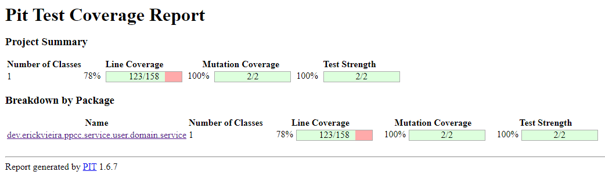

# PicPay Code Challenge

## Configuração do ambiente
Para rodar as aplicações, é necessário ter o [Docker](https://www.docker.com/products/docker-desktop) e o [JDK 11](https://adoptopenjdk.net) devidamente instalados na máquina.

Este repo conta com uma `docker-compose` file que configura a rede local e sobe todos os containeres necessários para que os microsserviços funcionem corretamente. No entanto, se preferir, é possível subir individualmente com os seguintes comandos:
```
docker network create ppcc_default --driver=bridge  

docker run -d --hostname ppcc-rabbitmq --name ppcc-rabbitmq -e RABBITMQ_DEFAULT_USER=ppcc -e RABBITMQ_DEFAULT_PASS=ppcc -p 5672:5672 rabbitmq:3  

docker run --name ppcc-user-postgres -e POSTGRES_PASSWORD=ppcc -e POSTGRES_USER=ppcc -e POSTGRES_DB=user_db --network redelocal -p 5434:5432 -d postgres:13.5

docker run --name ppcc-wallet-postgres -e POSTGRES_PASSWORD=ppcc -e POSTGRES_USER=ppcc -e POSTGRES_DB=wallet_db --network redelocal -p 5434:5432 -d postgres:13.5

docker run --name ppcc-banking-postgres -e POSTGRES_PASSWORD=ppcc -e POSTGRES_USER=ppcc -e POSTGRES_DB=banking_db --network redelocal -p 5434:5432 -d postgres:13.5
```

## Execução
As aplicações foram desenvolvidas utilizado a plataforma [Spring Cloud](https://spring.io/projects/spring-cloud), por conta disso não contam com uma Dockerfile, já que sobem em portas randômicas. Portanto, será necessário executá-las individualmente utilizando a IDE de sua preferência.

Para prosseguir, clone os seguintes repositórios:
- https://github.com/erickvieira-ppcc/dev.erickvieira.ppcc.config.server.git
- https://github.com/erickvieira-ppcc/dev.erickvieira.ppcc.service.discovery.git
- https://github.com/erickvieira-ppcc/dev.erickvieira.ppcc.api.gateway.git
- https://github.com/erickvieira-ppcc/dev.erickvieira.ppcc.service.user.git
- https://github.com/erickvieira-ppcc/dev.erickvieira.ppcc.service.wallet.git
- https://github.com/erickvieira-ppcc/dev.erickvieira.ppcc.service.banking.git

Após clonar todos eles, certifique-se de que os containeres estão rodando e atente-se para a seguinte ordem:
1. Execute a aplicação `dev.erickvieira.ppcc.config.server`
2. Execute a aplicação `dev.erickvieira.ppcc.service.discovery`
3. Execute a plicação `dev.erickvieira.ppcc.api.gateway` (opicional)
4. Execute as demais aplicações

> Atenção: executar as aplicações em uma ordem diferente pode resultar em erros. Se realmente quiser rodar apenas os serviços de regra de negócio, sobrescreva as variáveis de ambiente para pular as etapas de configuração, discovery, roteamento e load balancing do Spring Cloud, sobrescreva as variáveis de ambiente, tal qual foi feito na [application.properties do banking-service](https://github.com/erickvieira-ppcc/dev.erickvieira.ppcc.service.banking/blob/main/src/main/resources/application-test.properties) para viabilizar a execução do TestContainers.

Caso opte por rodar o `api.gateway` as aplicações que subirem em seguida firacam disponíveis nas seguintes URLs:
- http://localhost:8080/user-service/swagger-ui/
- http://localhost:8080/wallet-service/swagger-ui/
- http://localhost:8080/banking-service/swagger-ui/

No entanto, se preferir rodar cada aplicação no modo _standalone_ elas estão preparadas para exibir o link da swagger-ui no terminal após subirem corretamente.


Por fim, vale ressaltar que, pelo fato de serem aplicações Spring Cloud, elas se auto configuram ao se registrarem  no `service.discovery`, mas, se preferir, é possível sobrescrever algumas de suas propriedades usando variáveis de ambiente, seguindo o template a baixo:
```
SERVER_PORT=0  
EUREKA_SERVICE_URL=http://localhost:8083  
SPRING_DATA_SOURCE_URL=jdbc:postgresql://localhost:5432/user_db  
SPRING_DATA_SOURCE_USERNAME=ppcc  
SPRING_DATA_SOURCE_PASSWORD=ppcc  
SPRING_RABBITMQ_HOST=localhost  
SPRING_RABBITMQ_PORT=5672  
SPRING_RABBITMQ_USERNAME=ppcc  
SPRING_RABBITMQ_PASSWORD=ppcc  
PPCC_USER_RABBITMQ_QUEUE=user.queue  
PPCC_WALLET_RABBITMQ_QUEUE=wallet.queue  
```

> Obs.: a variável `SPRING_DATA_SOURCE_URL` varia de projeto a projeto, podendo terminar com `user_db`, `wallet_db` ou `banking_db`.

Caso queira ler na íntegra as variáveis de ambiente providas pelo `config.server`, acesse:
- https://github.com/erickvieira-ppcc/dev.erickvieira.ppcc.config.git

## Testes

O plano incial era que todas as aplicações contassem com testes unitários, integrados e mutantes. No entanto, devido ao prazo, algumas tecnicas de teste foram implementadas, em detrimento de outras (variando de projeto a projeto).

### Testes unitários  

As aplicações `user-service` e `wallet-service` contam com testes unitários que cobrem o funcionamento de boa parte dos services e extensions.  

É possível rodar os testes unitários com o comando `gradle test` na IDE ou pela CLI usando `./gradlew test`.

O report pode ser aberto consultado no seguinte path:
- build/reports/tests/test/index.html

#### Test report da aplicação `user-service`

#### Test report da aplicação `wallet-service`


### Testes mutantes  

Além dos testes unitários convencionais, as aplicações `user-service` e `wallet-service` também contam com testes mutantes que propositalmente geram mudanças no código para testar a qualidade dos testes unitários.  

É possível rodar os testes mutantes com o comando `gradle pitest` na IDE ou pela CLI usando `./gradlew pitest`.

O report pode ser aberto consultado no seguinte path:
- build/reports/tests/pitest/<< TIMESTAMP >>/index.html

#### Pitest report da aplicação `user-service`

#### Pitest report da aplicação `wallet-service`


### Testes integrados  

A única aplicação que conta com testes integrados é a `banking-service`.  

É possível rodar os testes mutantes com o comando `gradle pitest` na IDE ou pela CLI usando `./gradlew pitest`.

O report pode ser aberto consultado no seguinte path:
- build/reports/tests/pitest/<< TIMESTAMP >>/index.html

#### Integrated test report da aplicação `banking-service`


---

Em caso de dúvias, favor contate por e-mail:
- erick-vieira-s@outlook.com